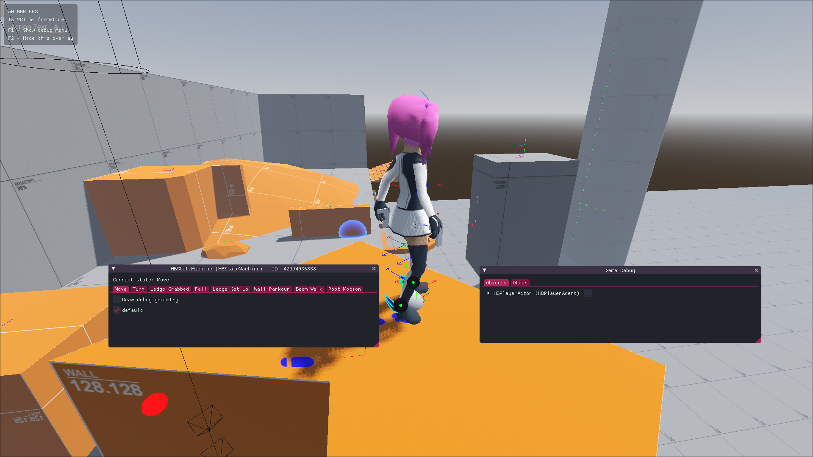

.. _doc_swansong_pitch:

The Pitch
=========

The following is EIRTeam's proposal for a stealth-adventure game, playable on Xbox One, Xbox Series, Linux and Windows. *Swansong* is a
reasonable evolution of existing free-running and stealth game concepts, together with a good dose of replayability, versatility and
freedom of tackling objectives in many different ways. *Swansong* fills a niche that has been neglected in the current market. It does
however attempt to keep things simple and self contained, both out of necessity and out of a desire to not create an overwhelmingly large (but soulless) experience.

Our objective is to give the player a god fantasy within a dark story of vigilante justice against a tyrannical society and all the conflict
and hardships that ocurr along the way. We hope to produce both the base game and at least one story expansion. A much longer and detailed
document will be available once development has started.

Game Design
-----------

*Swansong* is an adventure game where the main focus is on movement freedom and stealth. You play as Aurora, an artist turned
vigilante in an attempt to weaken the influence of an authoritarian state on its people.

All actions take place in a third person view, Aurora is able to navigate the different scenarios stealthily, by differentiating
between "**high profile**" and "**low profile**" actions, the latter of which won't trigger the supicions of guards when used in appropiate
settings. While the focus is on traditional stealth the player is also able to make use of **social stealth** where available,
where they are able to hide in **plain sight** by blending with the masses.

The game reuses the same scenarios with slight variations (such as patrol routes, time of day, varying obstacles) to create a dynamic
set of main and side missions. The various scenarios are pretty open ended, with the player being able to navigate them and complete
their mission in many different (and perhaps hilarious) ways. The player is also able to **replay** all missions to obtain a higher score on them,
which may give them special rewards.

*Aurora* has multiple tools at her disposal, including different **distraction devices** and **close range weapons**. Over the course of the game she
will obtain more gadgets that will serve as "toys" with which to creatively tackle the different challenges found on her missions.

Missions will include different objectives, such as stealing documents without being detected, assassinating an important officer or sabotaging the system.

Forays into the outside world will be broken up by stays at the **Sons of Liberty** mother base known as the **Homestead**, here Aurora will be able to
interact with other SoL members, check her progress and prepare herself for the next mission.

The star of the show is the **parkour/free running system**, through a series of simple commands the player is able to navigate the world by free running vertically
and horizontally. A system of player-controlled height priority is used, the player is able to tell *Aurora* whether he wants her to go to higher ground, to keep
the same height or to attempt to go lower. She will them try to navigate the world in front of her in a reliable and predictable way.

While it's generally advisable to avoid direct combat it sometimes may be the only choice. Aurora is able to fight using various sharp and blunt weapons, she doesn't
have access to modern weapons with high capacity magazines, but she's able to carry simple handguns and even a makeshift crossbow for ranged encounters, with heavily
limited ammo, as she has to conceal it.

In combat Aurora can parry attacks, initiate her own (both light and heavy), dodge/roll to the side or even run away. The combat is satisfying and visceral, with plenty of blood and
attempts to give the player a sort of "god" feeling. On the other hand she is also very fragile, so fighting with many enemies at the same time may be difficult.

Setting
^^^^^^^

*Swansong* is set in a near future where the world is ruled by an authoritarian form of government. Aurora, our protagonist attempts to reduce the influence of the
powers that be by sabotaging **Tranquility**, a centralised and heavily automated system that is said to be "capable of **perfectly enforcing virtually all laws**" through
various methods of mass surveillance and violent repression.

.. note::
    While the term *Sons of Liberty* here is inspired by MGS2 it was also the name of a group involved in the American Revolution that sided with the colonies.
    While this is clearly where Kojima also got the name from I wonder if there's some sort of ""problematic"" interpretation of the name in modern days that
    would make it unsuitable.

This system was effective for a few decades, that was until a mathematician was able to create an encrypted communications system that allowed the few underground
dissidents that remained to communicate and form *Sons of Liberty*. SoL was created to combat the *Tranquility* system, as its founders believed enforcing
laws perfectly lead to the seemingly unsurmountable authoritarian regime they currently live in.

*Sons of Liberty* is portrayed by the media machine as a "chaotic group of terrorists that side with undesirable groups who eat babies and molest dogs". So they do not
usually have sympathy from the general public, with them often calling for SoL members to be executed on sight.

*Aurora* was an artist that was turned into an example by *Tranquility* after her art brought her trouble with the justice system. After an escape from jail together with SoL founder
Michael Carmack she decides to join the organization. As a pretty capable gymnast in her childhood she is able to use her mobility to evade law enforcement and strike
from the shadows.

Throughout her journey *Aurora* will find herself facing the Metro Police, a technologically-enhanced semi-military wing of the *Tranquility* system. The scenarios will be populated with
Metrocop that perform various patrol routes and have varying detection senses depending on the time of day or even the climatology of the day. Metro Cops are usually equipped with state of
the art melee weaponry and a limited amount of low firing rate handguns that are tied to the owner through the *Tranquility* system and thus unable to be fired by anyone else.

The equipment used on Aurora's mission will be makeshift, rudimentary and rugged due to the inability to use stolen weaponry. But will become upgraded throughout the course of the adventure.
The items will be themed around various weapons used by different warriors throughout history.

The main target in the game is the *God Box*, a special computerised system that gives unrestricted access to the *Tranquility* system, which the SoL hope to use to disrupt it or even destroy it.
Throughout the story progression this is the main objective being chased, the ever elusive golden goose.

An open ending will allow for a prequel expansion or expansions to be developed after the game has shipped.

Gameplay Loop
^^^^^^^^^^^^^

A walkthrough of an example game session follows:

After starting the game, the player is faced with a series of options, such as continuing their already saved game, starting a new one, changing the settings and exiting the game.
After continuing with their mid-game save file the player is dropped off at the *Homestead*, where they can check their progress, chat with other SoP members or start missions.

Once the player choses a mission he will be informed of the location, the conditions and the mission objective(s). The player then choses his equipment and starts the mission.

In this example mission, the player is sent to a town near a *Tranquility* control center, a camp where *Tranquility* systems are hosted, in order to retrieve memory chips that are needed
to learn more about how the system operates internally, and perhaps obtain some kind of clue on the whereabouts of the *God Box*.

As the path to take to reach the center is not public knowledge, she is advised by SoL to interrogate a Metrocop and try to obtain directions. She does so by tracking a high ranking Metrocop
officer and blending with the masses to follow him, she can do this through various ways, hiding among clusters of citizens, hiding inside garbage bins, sitting next to someone at a bench etc.

Note that this is not necessarily the only way to achieve this, the player has a choice on when and where to strike the target, one can wait and follow him
until he is isolated and use the masses to blend in, boldly attack him (with the risk that entails) or tail him through the building roofs, with the risk of
guards being stationed up there.

After she interrogates her target, she them promptly executes the officer and hides the corpse in a nearby garbage container. Aurora now reaches the road to the control center, where she carefuly
navigates the dark environment in a lookout for guards, being interrupted by the CODEX system to inform her of the presence of enemies.

At the control center, she infiltrates into the main field through a hole in the surrounding fence, where she once again sneaks past floodlights and various patrolling guards to reach the main
building.

Upon reaching the main building, she is then told through CODEX to once again interrogate an officer or try to find the memory chips on her own.

After grabbing the memory chips, a cutscene plays where she is caught by a Metrocop who then gives the voice of alarm. Aurora fights a group of them which she promptly beats by parrying
their attacks and counter-attacking. After beating the initial group, a bigger group of pursuers appears and she then decides to flee.

The Metrocops are now on high alert, being more agressive and less forgiving to stealth, so a loud escape is not a bad idea.

Aurora escapes the building by running past guards and avoiding them, returning to the nearby town and losing her pursuers.

The mission then ends, presenting the player with some statistics of their mission and giving them a rank that varies from D to S, with S being the highest. A cutscene then plays that presents
the next mission, after which aurora is sent back to the Homestead.

Marketing
---------

While *Swansong* may share elements with previous stealth action-adventure titles unlike them it is not developed by a modern big international studio. This allows plenty of space for fanservice
of many different kinds, for history nerds, for parkour nerds and even for horny internet people who like to draw naked women.

There are really two sides to *Swansong*, the game itself and the flexible unconstrained-by-corporations nature of it, much like the protagonists of the story the game attempts to cater to
fans of videogames who aren't happy with the current status quo of very neutralized and bland storytelling that doesn't attempt risky things.

*Swansong*'s rarity as an independent game of these characteristics, one that tries to tell a mature, semi-beliveable story with a complex parkour system on top of it, something that even
bigger studios seem to have dropped the ball at is its main uniqueness. It isn't entirely without precedent however, as other censorship-resistant titles like *Little Witch Nobeta*,
*The Coffin of Andy and Leyley* and, until recently, *Skullgirls* have achieved good levels of popularity without breaking the bank in terms of budget and are loved by a small but very dedicated
playerbase, this is a double-edged sword as such playerbase also tends to be very critical, so it's important to deliver a good product to them.

Development
-----------

It is important to understand that one of Swansong's key development pillars is going to be economy and doing more with less. Resources are obviously extremely limited due to the very small
(currently single person) operation that is EIRTeam. It is very important to reuse resources and scenarios as much as possible and to use procedural generation of assets throughout all development.

The team required to build Swansong with a minimal set of features will be as follows:

- 1x Generalist that can help on more than one thing and can integrate it all together (covered by EIREXE)
- 1-2x concept illustrators*
- 1-2x Production illustrators (for mostly 2D elements of the game)*
- 1x 3D artist
- 1x Level designer*
- 1x Musician*

Do note that most of these roles can overlap, as concept artists can become production artists later for example.

Roles marked with \* are those that EIRTeam already has contacts with and could easily fill.

While the above list is what's necessary for a minimal working product, a more extensive team could allow the game to have extra features that are "nice-to-haves", such as voice acting.

(EIRTeam does have contacts with voice actors, but once again monetary budget is the limiting factor)

While the development has many unknowns, a rough timeline can be described in three phases, prototyping, development, and polish.

Prototyping
^^^^^^^^^^^

This is the current phase, where a playable prototype is developed with no intentions of looking good, but that simply exists to validate if the desired game concepts are even possible to do.

Most of the focus so far has been in the parkour/free-running system, which is the core element that ties all of the game together. It was very important to verify that it was even a doable
task, while it ended up being a bigger challenge than anticipated it has been a perfectly surmountable task, with the working prototype implementing most of the parkour concepts that will
be required for the game.

Work on the prototype began in late 2022, with the development of a custom animation system being an essential but complicated task. The result is a performant bespoke system that works
very predictably and reliably.

Next on this phase is work on the combat system. Afterwards the mission system will be the main focus.

Development
^^^^^^^^^^^

This is the phase where the lessons learned from the prototype are put to use, specific missions are developed, the existing systems will become a sort of "sandbox" that designers
can use to develop the meat of the story.

During this time and for the rest of development, things are constantly playtested, with testing being done at least once a month.

It is extremely important to have players test the game with 0 development input, with notes from their sessions being used to further refine or change the game and give it shape.

Polish
^^^^^^

After the game has achieved a significant level of progression, final broad changes will be performed and the story will be frozen, with further development being focused on getting
the game ready to reach store shelves and tying it all together.